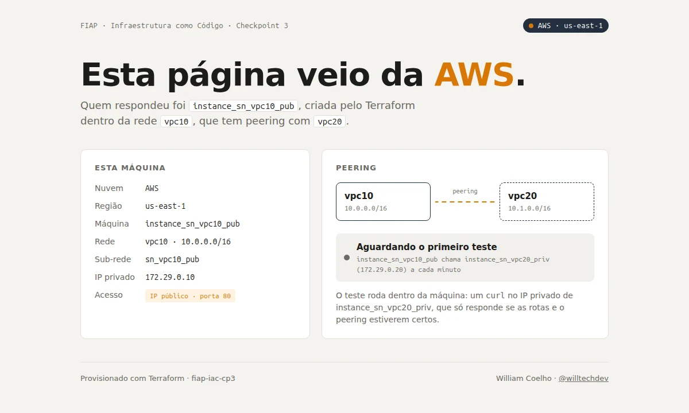
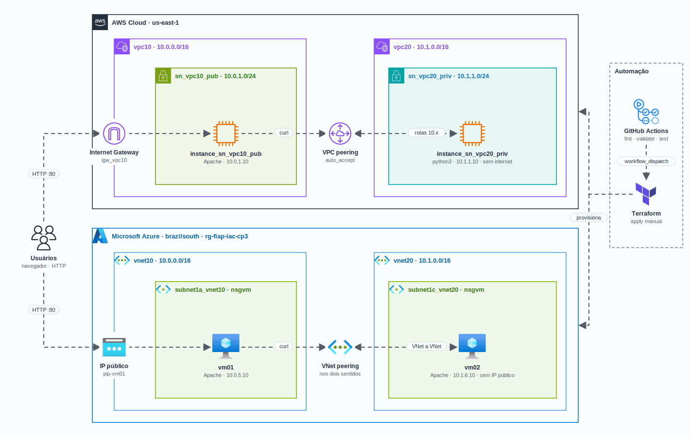

<h1 align="center">
  CP3 - Terraform multicloud com peering na AWS e na Azure
</h1>

<p align="center">
  
</p>

<p align="center">
  <a href="https://skillicons.dev">
    
  </a>
</p>

## Qual a finalidade do projeto?

Checkpoint 3 da disciplina de **Infraestrutura como Código** (FIAP, outubro de 2024). O desafio era provisionar, com **Terraform** e um **pipeline do GitHub Actions**, a mesma topologia em duas nuvens: **duas redes privadas ligadas por peering** na **AWS** (VPCs) e na **Azure** (VNets), com máquinas virtuais em cada lado.

Em cada nuvem, a primeira rede tem uma máquina com IP público que serve uma página web; a segunda rede tem uma máquina **só com IP privado**, que só pode ser alcançada pelo peering. A página mostra de qual nuvem e de qual máquina veio a resposta e se o peering está funcionando, com um teste que roda dentro da própria VM.

## Arquitetura

<p align="center">
  
</p>

## O que foi construído

### AWS (`terraform/aws`, região `us-east-1`)

| Recurso | Nome | Detalhe |
|---|---|---|
| VPC | `vpc10` | `10.0.0.0/16`, DNS hostnames ligado |
| VPC | `vpc20` | `10.1.0.0/16` |
| Sub-rede pública | `sn_vpc10_pub` | `10.0.1.0/24`, IP público automático |
| Sub-rede privada | `sn_vpc20_priv` | `10.1.1.0/24`, sem internet |
| Internet Gateway | `igw_vpc10` | só na vpc10 |
| VPC peering | `vpc_peering` | vpc10 com vpc20, `auto_accept` |
| Route tables | `rt_sn_vpc10_pub`, `rt_sn_vpc20_priv` | rota para a outra VPC pelo peering; a pública também tem `0.0.0.0/0` para o IGW |
| Security groups | `sg_ec2_vpc10_pub`, `sg_ec2_vpc20_priv` | tráfego livre entre as VPCs; a pública aceita HTTP 80 e SSH 22 |
| EC2 | `instance_sn_vpc10_pub` | Ubuntu 22.04, `10.0.1.10`, Apache |
| EC2 | `instance_sn_vpc20_priv` | Ubuntu 22.04, `10.1.1.10`, sem internet: serve a página com `python3` |

### Azure (`terraform/azure`, região `brazilsouth`)

| Recurso | Nome | Detalhe |
|---|---|---|
| Resource group | `rg-fiap-iac-cp3` | todos os recursos |
| VNet | `vnet10` | `10.0.0.0/16` |
| VNet | `vnet20` | `10.1.0.0/16` |
| Sub-redes | `subnet1a_vnet10`, `subnet1c_vnet20` | `10.0.5.0/24` e `10.1.6.0/24` |
| NSG | `nsgvm` | HTTP 80 aberto e SSH 22 pela origem em `ssh_source_cidr`, nas duas sub-redes |
| VNet peering | `vnet10-to-vnet20`, `vnet20-to-vnet10` | um recurso em cada sentido |
| IP público | `pip-vm01` | Standard, estático, rótulo DNS opcional |
| VMs | `vm01`, `vm02` | Ubuntu 22.04, `Standard_DS1_v2`, `10.0.5.10` (com IP público) e `10.1.6.10` (só privado) |

### Módulo compartilhado (`terraform/modules/web-page`)

Um módulo sem recursos que gera o script de inicialização das quatro máquinas (`user_data` na AWS, `custom_data` na Azure):

| Etapa | O que faz |
|---|---|
| Servidor web | Instala o Apache; se a máquina não tem internet, usa o `python3` que já vem no Ubuntu |
| Página | Grava o `index.html` renderizado pelo Terraform com a nuvem, região, rede, sub-rede e IPs da máquina |
| Teste de peering | Agenda no `cron` um `curl` de minuto em minuto no IP privado da máquina do outro lado e grava o resultado em `peer.json`, que a página lê |

### Decisões técnicas

| Ponto | Como ficou | Por quê |
|---|---|---|
| Acesso às VMs da Azure | `azurerm_linux_virtual_machine` com `admin_ssh_key` e senha desativada | Nenhuma senha no código; a chave pública vem de variável ou secret |
| Rota do peering na AWS | `vpc_peering_connection_id` nas route tables | É o campo certo para o destino ser a conexão de peering |
| Faixas de IP | `10.0.0.0/16` e `10.1.0.0/16` | Faixas privadas (RFC 1918) que não se sobrepõem |
| SSH | Regra `SSH` com origem em `ssh_source_cidr` | A porta 22 não fica aberta para qualquer origem |
| Máquinas opcionais | `deploy_vms` (padrão `true`) | Permite subir só as redes e o peering |
| Sem load balancer | Cada rede pública tem acesso direto | O Azure Load Balancer não aceita, no mesmo pool, VMs de VNets diferentes |
| Backend | Configuração parcial com `backend.hcl.example` | Bucket e storage account ficam fora do repositório |
| Pipeline | CI sem credenciais e deploy manual | Nenhum push mexe na nuvem |
| Organização | Arquivos por assunto (rede, peering, segurança, máquinas), variáveis e outputs | Leitura e manutenção |

### Pipeline

| Workflow | Quando | O que faz | Credenciais |
|---|---|---|---|
| `terraform-ci.yaml` | todo push e PR | `fmt -check`, `init -backend=false`, `validate` e `terraform test` nas duas pastas; simulação das VMs com Docker | nenhuma |
| `terraform-deploy.yaml` | manual (`workflow_dispatch`) | escolhe nuvem e ação (`plan`, `apply` ou `destroy`) | secrets da nuvem e do backend |

## Tecnologias utilizadas

- **Terraform 1.9:** providers `hashicorp/aws ~> 5.70` e `hashicorp/azurerm ~> 4.5`, `terraform test` com `mock_provider`;
- **AWS:** VPC, sub-redes, Internet Gateway, VPC peering, route tables, security groups e EC2;
- **Azure:** resource group, VNets, sub-redes, NSG, VNet peering, IP público e VMs Linux;
- **GitHub Actions:** CI sem credenciais e deploy manual;
- **Ubuntu 22.04 + Apache:** imagem das máquinas e servidor da página;
- **Bash, HTML e CSS:** script de inicialização e página, sem dependências externas (a máquina privada da AWS não tem internet);
- **Docker:** simulação local das máquinas e execução do Terraform.

## Estrutura do repositório

```text
fiap-iac-cp3/
├── terraform/
│   ├── aws/
│   │   ├── provider.tf               # provider e backend S3 parcial
│   │   ├── network.tf                # VPCs, sub-redes, IGW e route tables
│   │   ├── peering.tf                # VPC peering
│   │   ├── security.tf               # security groups
│   │   ├── compute.tf                # EC2 e página de cada uma
│   │   ├── variables.tf / outputs.tf
│   │   ├── backend.hcl.example       # bucket e tabela do state
│   │   ├── terraform.tfvars.example  # key pair e origem do SSH
│   │   └── tests/aws.tftest.hcl      # terraform test com provider simulado
│   ├── azure/                        # mesma divisão, com backend azurerm
│   └── modules/web-page/             # script de inicialização e página das VMs
├── tests/local/                      # simulação das máquinas com Docker
├── .github/workflows/
│   ├── terraform-ci.yaml             # validação sem credenciais
│   └── terraform-deploy.yaml         # plan/apply/destroy manual
└── docs/                             # diagrama e demo
```

## Fluxo de funcionamento

1. Um push ou PR dispara o **Terraform CI**: formatação, validação das duas pastas, `terraform test` e a simulação com Docker, tudo sem credencial.
2. Para criar a infraestrutura, o **Terraform Deploy** é disparado à mão, escolhendo `aws` ou `azure` e `plan`, `apply` ou `destroy`.
3. O Terraform cria as duas redes, as sub-redes, as rotas e o peering; depois as máquinas, cada uma com o script gerado pelo módulo `web-page`.
4. Na inicialização, a máquina pública instala o Apache e grava a página. A privada da AWS, sem internet, serve a mesma página com `python3`.
5. A cada minuto, cada máquina faz um `curl` no IP privado da outra. A resposta só chega se as route tables (AWS) ou o peering nos dois sentidos (Azure) estiverem certos.
6. O usuário abre o IP público (output `public_instance_url` ou `vm01_url`) e vê a página com o estado do peering.

## Como rodar

> A infraestrutura cria recursos pagos (EC2, VMs, IP público). Rode `destroy` ao terminar.

### Pelo GitHub Actions

Cadastre em **Settings > Secrets and variables > Actions**:

| Nome | Tipo | Nuvem | Uso |
|---|---|---|---|
| `AWS_ACCESS_KEY_ID`, `AWS_SECRET_ACCESS_KEY`, `AWS_SESSION_TOKEN` | secret | AWS | credenciais (no AWS Academy, as da sessão do lab) |
| `TF_STATE_BUCKET`, `TF_STATE_LOCK_TABLE` | secret | AWS | bucket S3 e tabela DynamoDB do state |
| `ARM_CLIENT_ID`, `ARM_CLIENT_SECRET`, `ARM_SUBSCRIPTION_ID`, `ARM_TENANT_ID` | secret | Azure | service principal |
| `TF_STATE_RESOURCE_GROUP`, `TF_STATE_STORAGE_ACCOUNT` | secret | Azure | storage account do state (container `tfstate`) |
| `SSH_PUBLIC_KEY` | secret | Azure | chave pública das VMs |
| `AWS_KEY_NAME` | variable | AWS | key pair das EC2 (opcional, ex.: `vockey`) |
| `SSH_SOURCE_CIDR` | variable | as duas | seu IP com `/32` para o SSH (opcional) |

Depois: **Actions > Terraform Deploy > Run workflow**.

### Na sua máquina

```bash
cd terraform/aws                                   # ou terraform/azure
cp backend.hcl.example backend.hcl                 # troque pelos seus recursos
cp terraform.tfvars.example terraform.tfvars       # chave SSH, key pair, seu IP
terraform init -backend-config=backend.hcl
terraform plan
terraform apply
terraform output                                   # URL da página
terraform destroy
```

Para subir só a rede e o peering, sem máquinas: `terraform apply -var deploy_vms=false`.

Sem Terraform instalado, dá para usar a imagem oficial:

```bash
docker run --rm -v "$PWD":/w -w /w hashicorp/terraform:1.9 -chdir=terraform/aws init -backend=false
```

## Como validar a entrega

Tudo abaixo roda sem conta de nuvem. Este repositório **não foi aplicado na AWS nem na Azure** depois da reorganização: a validação foi feita com os comandos a seguir.

```bash
# formatação e validação das duas pastas
terraform fmt -check -recursive
terraform -chdir=terraform/aws init -backend=false && terraform -chdir=terraform/aws validate
terraform -chdir=terraform/azure init -backend=false && terraform -chdir=terraform/azure validate

# testes com provider simulado (nenhuma chamada às nuvens)
terraform -chdir=terraform/aws test      # 2 passed
terraform -chdir=terraform/azure test    # 3 passed

# as duas máquinas simuladas com Docker, rodando o script de inicialização real
tests/local/simular.sh                   # página em http://localhost:18380
tests/local/simular.sh down
```

O que os testes conferem:

- as VPCs usam `10.0.0.0/16` e `10.1.0.0/16` e cada route table tem a rota para a outra VPC por `vpc_peering_connection_id`;
- a `vpc20` só tem a rota do peering (continua privada);
- os dois peerings da Azure apontam para a VNet certa;
- as VMs da Azure não aceitam senha, e o `plan` falha se a chave SSH não for informada;
- só a `vm01` tem IP público, e cada máquina testa o IP privado da outra;
- com `deploy_vms = false` nenhuma máquina é criada.

A simulação cria duas máquinas Ubuntu em Docker: a "web" com internet e a "priv" só numa rede interna, sem saída, como a sub-rede privada da AWS. O resultado esperado:

```text
  ok    página da web em http://localhost:18380
  ok    web alcança priv pelo IP privado
  ok    priv alcança web pelo IP privado
  ok    priv sem internet (usou python3 no lugar do Apache)
```

A demo no topo deste README foi gravada nessa simulação (por isso os IPs `172.29.0.x`); na nuvem aparecem os IPs `10.x` das tabelas acima.

## Autor

**William Coelho** · RM 556336 · [@willtechdev](https://github.com/willtechdev)
